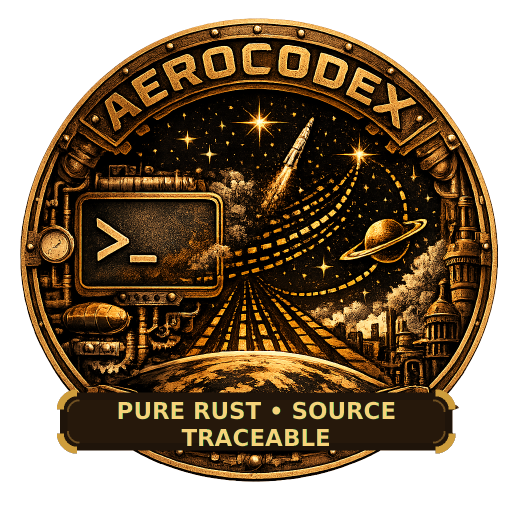

# AeroCodex

<p align="center">
  
</p>

**AeroCodex: Verified Aerospace Engineering Mathematics in Pure Rust**

AeroCodex is a Phase 0.001 Rust workspace for source-traceable aerospace engineering mathematics. The human roadmap phase is `Phase 0.001`; the Cargo-compatible package version for all workspace packages during this phase is locked to `0.0.1`. Do not use `0.001` as a Cargo package version.

## Safety and certification caveat

AeroCodex is provided for research purposes only as an engineering mathematics library for research, education, verification-oriented development, and preliminary design. Safety-critical, regulated, operational, or mission use requires project-specific assurance, validation, qualification, and certification.

AeroCodex is **not** certified, flight-ready, mission-ready, or approved for aircraft or spacecraft operations.

## Pure Rust policy

The core repository is intentionally pure Rust. The repository does not include C/C++/Fortran source, BLAS/LAPACK native linkage, CEA/REFPROP/CoolProp/Cantera wrappers, Python/Matlab/Julia runtime dependencies, `bindgen`, `cc`, `cmake`, `pkg-config`, `vcpkg`, native binary blobs, or generated binaries.

## Workspace crates

- `aero-codex-core`: shared result, error, verification, and scalar unit types.
- `aero-codex-constants`: Phase 0.001 constants.
- `aero-codex-atmosphere`: sea-level, simplified troposphere, speed-of-sound, and conservative trace-metadata primitives.
- `aero-codex-thermo`: perfect-gas density, speed-of-sound, heat-capacity, and molar-mass gas-constant helpers.
- `aero-codex-gas-dynamics`: reviewed direct isentropic, normal-shock, Mach-angle, Prandtl-Meyer, and branch-explicit oblique-shock perfect-gas relations.
- `aero-codex-aerodynamics`: reviewed dynamic-pressure, lift, drag, coefficient inverse, and induced-drag helpers with conservative trace metadata.
- `aero-codex-propulsion`: reviewed Tsiolkovsky rocket-equation, ideal thrust, specific impulse, and ideal choked mass-flux helpers with conservative trace metadata.
- `aero-codex-heat-transfer`: reviewed Stefan-Boltzmann radiation, Newton-law convection, and one-dimensional conduction helpers with conservative trace metadata.
- `aero-codex-structures`: reviewed axial stress, bending stress, cantilever end-load deflection, and Euler column buckling helpers with conservative trace metadata.
- `aero-codex-flight-dynamics`: reviewed level coordinated-turn, stall-speed, and specific-excess-power helpers with conservative trace metadata.
- `aero-codex-astrodynamics`: reviewed circular-orbit speed, circular period, escape velocity, vis-viva, specific orbital energy, Hohmann transfer, and sphere-of-influence helpers with conservative trace metadata.
- `aero-codex-life-support`: reviewed Phase 0.001 bio-regenerative closure-fraction, production-area, buffer-residence-time, crew-requirement, net-balance, oxygen/carbon-dioxide, and water-recovery mass-balance primitives with conservative trace metadata; now also includes equation-traceable thin-film/biofilm BLSS kernels for MELiSSA C4a photobioreactor models, MELiSSA C3 nitrifying biofilm models, attached algal thin-film/PDE helpers, reduced-order service vectors, and source-preserved citation maps.
- `xtask`: local validation and dependency-policy checks.

## Validation artifacts

Validation cards live under `validation/cards/`, source-registry seed files live under `validation/source_registry/`, and the Codex Card schema lives under `validation/schema/`. See `validation/README.md` for the Phase 0.001 validation scaffold and status ladder. Current cards and source-registry seeds intentionally remain conservative `research_required` artifacts unless exact source, test, and validation evidence has been reviewed. The Phase 0.001 non-example cards are planning artifacts only; they cover atmosphere, thermodynamics, gas dynamics, aerodynamics, propulsion, heat transfer, structures, flight dynamics, astrodynamics, and life-support mass-balance scaffolding. Their presence does not imply source validation, certification, flight readiness, mission readiness, or operational approval.


## Nomenclature and acronym policy

AeroCodex now treats nomenclature as a governed repository artifact. The policy and registries live under `nomenclature/`, with the canonical protocol in `nomenclature/docs/ACX-NOM-001.md`. New durable acronyms, initialisms, shorthand tokens, source-authority labels, aliases, and math-symbol mappings must be registered, explicitly waived, or covered by the adoption baseline.

The repository-wide adoption scan is captured in `nomenclature/generated/current_repo_acronym_inventory.*` and `nomenclature/generated/current_repo_acronym_baseline.json`. The baseline is not an approval list; it only prevents future changes from silently adding unregistered acronym-like tokens. The AI-facing terminology index is `nomenclature/generated/terminology/index.jsonl`.

## Citation guidelines

These citation guidelines are part of the root README landing page and should remain visible on `main`.

- Cite the original equation, dataset, standard, paper, report, or source material for any AeroCodex calculation you discuss or reuse; do not cite AeroCodex alone as the mathematical authority.
- Cite the exact AeroCodex repository commit, crate, function, validation card, and source-registry entry used for reproducibility.
- For thin-film BLSS work, also cite `citations/blss_thinfilm_refs.bib`, `data/thinfilm/equation_manifest.csv`, `data/thinfilm/source_verification.csv`, and the runtime source map in `crates/aero-codex-life-support/src/thinfilm_provenance.rs` when those materials support the claim.
- Preserve the conservative status labels from the validation cards and source registry. Do not upgrade `research_required` or equation-traceable research kernels into certification, flight-readiness, mission-readiness, operational, medical, or habitat-safety claims.
- When adding a new public calculation, add or update its source-registry entry, validation card, tests, evidence-card linkage, and README-facing citation guidance before treating it as stable.

## Recommended checks

```bash
cargo fmt --all -- --check
cargo clippy --workspace --all-targets --all-features -- -D warnings
cargo test --workspace --all-features
cargo run -p xtask -- verify --all
cargo run -p xtask -- verify cards
cargo run -p xtask -- verify source-registry
cargo run -p xtask -- dependency-policy
python nomenclature/tooling/aerocodex_nom_lint.py --root nomenclature
python nomenclature/tooling/aerocodex_acronym_inventory.py --repo-root . --nomenclature-root nomenclature --check-new --baseline nomenclature/generated/current_repo_acronym_baseline.json
python nomenclature/tooling/aerocodex_terminology.py --root nomenclature export-jsonl --output nomenclature/generated/terminology/index.jsonl
# Version lock sanity checks:
grep -n 'version = "0.0.1"' Cargo.toml
grep -RIn '0\.001' --include Cargo.toml . && exit 1 || true
grep -RIn '^version = ' crates xtask --include Cargo.toml && exit 1 || true
cargo doc --workspace --all-features --no-deps
```

The generation environment for this package did not have `rustc` or `cargo`, so these checks must be run by the deployment agent.

## Thin-film BLSS extension

The thin-film BLSS conversion package adds source materials, citation manifests, validation cards, and pure-Rust equation kernels derived from the supplied `blss_thinfilm_report` materials. Key files:

- `DATA_MANIFEST.toml` - package data manifest with key-file hashes.
- `citations/blss_thinfilm_refs.bib` - preserved supplied BibTeX.
- `data/thinfilm/equation_manifest.csv` - equation-to-function-to-citation map.
- `data/thinfilm/source_verification.csv` - bibliographic verification notes.
- `crates/aero-codex-life-support/src/thinfilm_provenance.rs` - runtime source/citation map.
- `scripts/verify_thinfilm_artifact.py` - dependency-free static artifact verifier.

The added equations are equation-traceable research kernels for research purposes only. They are not calibrated life-support designs and do not imply flight, habitat-safety, medical, or mission readiness.
