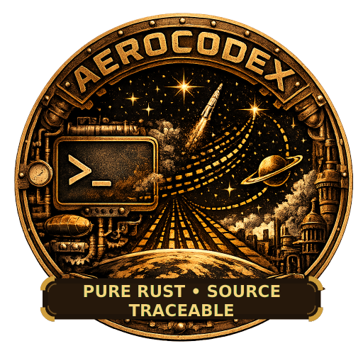

# AeroCodex

<!-- aerocodex-current-identity:start -->
Release version: `0.1.0-alpha.1`
Release tier: `research_software_alpha` (`Research Software Alpha`)
Workspace packages: `14`
Registry formulas: `152`
Blocked formulas: `152`
Publicly executable formulas: `0`
<!-- aerocodex-current-identity:end -->

<p align="center">
  
</p>

**Source-traceable aerospace, astrodynamics, and bio-regenerative life-support mathematics in pure Rust.**

AeroCodex is a Phase 0.001 Rust workspace for research, education, verification-oriented development, and preliminary design. The human roadmap phase remains `Phase 0.001`, while the current Cargo-compatible semantic version is `0.1.0-alpha.1`. Roadmap phase and package version are separate concepts; do not use `0.001` as a Cargo package version.

Research-readiness planning authority: the v0.7.2 [research readiness decision packet](docs/roadmap/research_readiness_agent_decision_packet.md) states that AeroCodex is intended to become professional-grade, traceable aerospace research software suitable for academic, laboratory, and agency evaluation. It is not certified for flight, mission operations, habitat safety, medical/life-support decisions, or regulatory approval.

## Current governed state

AeroCodex currently records a closed external M07 metadata-accounting state in the governed inventory. The current readiness count source of truth is `docs/roadmap/research_readiness_counts.md`, which separates inventory visibility, runtime implementation, CLI accessibility, validation status, execution readiness, and M07 quarantine.

That count source explicitly keeps M07 terminal rows quarantined and states that the 1,323 M07 rows are not 1,323 usable equations. This closure does **not** claim M07/Scilab parity, certification, flight readiness, mission readiness, operational approval, medical approval, or regulated-use approval.

## Safety and certification caveat

AeroCodex is **not** certified, flight-ready, mission-ready, habitat-safe, medical, operational, or regulated-use approved. Use it as research and preliminary-design engineering mathematics only. Safety-critical, regulated, operational, crewed, habitat, medical, or mission use requires independent project-specific assurance, validation, qualification, and certification.

Negative statements such as “not certified” and “does not currently provide certified flight software” are intentional safety disclaimers. They must not be weakened, removed, or misread as positive readiness assertions.

The enforced public wording guardrails live in `docs/assurance/public_wording_guardrails.md` and are checked by `cargo run -p xtask -- verify --all`.

## Pure Rust policy

The core repository is intentionally pure Rust. It does not include C/C++/Fortran source, BLAS/LAPACK native linkage, CEA/REFPROP/CoolProp/Cantera wrappers, non-Rust scripting or numerical-runtime dependencies, `bindgen`, `cc`, `cmake`, `pkg-config`, `vcpkg`, native binary blobs, generated binaries, or a committed root `Cargo.lock`.

The repository intentionally keeps the root `Cargo.lock` absent during the current workspace phase.

## What AeroCodex can do now

AeroCodex currently provides source-traceable research kernels for common engineering calculations across atmosphere, thermodynamics, gas dynamics, aerodynamics, propulsion, heat transfer, structures, flight dynamics, astrodynamics, and bio-regenerative life-support scaffolding.

It also provides governance machinery:

- validation cards and source-registry seeds;
- data/source registry policy and governed in-repo artifact hashes;
- formula-vault intake/provenance records and runtime-resolution manifests;
- equation inventory/readiness accounting;
- nomenclature, acronym, symbol, terminology, and waiver policy data;
- clean-room BioSim-RS-style resource identity, transaction, deterministic replay, ledger, and smoke/friend-test primitives;
- clean-room BioSim-plus synthetic scenario-domain records, structural validation, process records, intent-planning helpers, bounded compartment replay/digest/event helpers, and replay-integrity/ledger/report helpers for research metadata only;
- a bounded `aerocodex` research-alpha CLI for deterministic registry inventory, status reporting, and self-checking; its twelve M00 dispatch-linked records remain `research_required`, blocked from public formula execution, and non-promoted.

AeroCodex does **not** currently provide certified flight software, a complete BioSim scenario engine, an operational BLSS controller, a validated habitat-safety model, a medical model, or certified M07/Orekit parity.

## Workspace crates

| Crate | Current role |
|---|---|
| `aero-codex-core` | Shared result, error, validation, traceability, and scalar unit types. |
| `aero-codex-constants` | Phase 0.001 constants and source seeds. |
| `aero-codex-atmosphere` | Sea-level, simplified troposphere, density, pressure, temperature, and speed-of-sound helpers. |
| `aero-codex-thermo` | Perfect-gas density, speed of sound, heat-capacity, and molar-mass gas-constant helpers. |
| `aero-codex-gas-dynamics` | Isentropic, normal-shock, Mach-angle, Prandtl-Meyer, and branch-explicit oblique-shock relations. |
| `aero-codex-aerodynamics` | Dynamic pressure, lift, drag, coefficient inverses, and induced-drag helpers. |
| `aero-codex-propulsion` | Rocket equation, ideal thrust, specific impulse, and ideal choked mass-flux helpers. |
| `aero-codex-heat-transfer` | Stefan-Boltzmann radiation, Newton-law convection, and one-dimensional conduction helpers. |
| `aero-codex-structures` | Axial stress, bending stress, cantilever end-load deflection, and Euler column buckling helpers. |
| `aero-codex-flight-dynamics` | Level-turn, stall-speed, turn-rate/radius, and specific-excess-power helpers. |
| `aero-codex-astrodynamics` | Two-body orbital helpers, Hohmann transfer helpers, sphere of influence, bounded M00 angle/unit/vector helpers including `m00_wrap2pi`, classical-elements/Kepler research helpers, oracle-record/tolerance-comparison metadata helpers, contract-only two-line-element source-policy helpers, and runtime-linked formula-vault intake records. |
| `aero-codex-life-support` | BLSS mass-balance helpers, thin-film/MELiSSA research kernels, clean-room BioSim-style resource/tick primitives, BioSim-plus synthetic scenario-domain validation, bounded process/intent helpers, compartment replay/digest/event helpers, and replay-integrity/ledger/report helpers. |
| `aero-codex-cli` | Research-alpha inventory/status binary with twelve M00 dispatch-linked records, stable JSON output, exit codes, bounded self-checks, and fail-closed public formula execution. |
| `xtask` | Dependency-free Rust local governance, validation, data-registry, formula-vault, equation-batch-manifest, and inventory checks. |

## Developer quickstart

AeroCodex uses Rust stable only and a cargo-first workflow for the first research-readiness milestone. Linux and macOS are the primary contributor targets; Windows should not be intentionally broken. This repository is research/preliminary-design software and is not certified for flight, mission operations, habitat safety, medical/life-support decisions, or regulatory approval.

Fresh-clone baseline commands:

```bash
git clone https://github.com/sci-labs-ai/AeroCodex.git
cd AeroCodex
cargo fmt --check
cargo clippy --all-targets --all-features -- -D warnings
cargo test --all
cargo doc --no-deps
cargo run -p xtask -- verify --all
```

See [toolchain baseline](docs/development/toolchain.md) and [CI/local verification gates](docs/development/ci_gates.md) for the RR-003 tooling baseline, including future deterministic registry and formula status/gating check placeholders.

## Research-alpha CLI status

The CLI can list and describe the governed Formula Registry and has twelve M00 runtime dispatch links: ten canonical-unit records and two angle-conversion records. All remain `research_required`, with `execution_policy=blocked` and `public_executable=false`; a runtime symbol or dispatch link is not execution authorization.

```bash
cargo run -p aero-codex-cli -- version --json
cargo run -p aero-codex-cli -- formula list --family m00 --json
cargo run -p aero-codex-cli -- formula describe \
  m00.canonical.distance_to_canonical --json
cargo run -p aero-codex-cli -- formula status-report --json
cargo run -p aero-codex-cli -- self-check --json
```

A clean self-check reports 14 passing checks and zero failures, but self-check dispatch is not public formula execution and does not promote status. The sole machine-readable release authority is [`release/release-manifest.toml`](release/release-manifest.toml); the live batch record is [`docs/release/v0.1.0-alpha.1-status.md`](docs/release/v0.1.0-alpha.1-status.md). The current Cargo version is `0.1.0-alpha.1`, and no operational, parity, safety, or certification claim is made.

## Validation and governance artifacts

Key governance surfaces:

- `validation/cards/` — validation-planning cards.
- `validation/source_registry/` — conservative source-registry seed files.
- `validation/equation_inventory.tsv` — machine-readable equation inventory/readiness accounting.
- `validation/schema/` — Codex Card schema.
- `data-governance/` — data/source policy and governed in-repo/external artifact registry.
- `formula-vault/` — quarantined formula-candidate metadata, contracts, manifests, and implementation gates.
- `nomenclature/` — acronym, symbol, terminology, and waiver policy.

Current cards, source-registry seeds, formula-vault dispositions, and external M07 terminal metadata remain conservative `research_required` artifacts unless exact source, test, tolerance, and validation evidence has been reviewed. A validation card, source-registry seed, or terminal metadata disposition does not imply certification, flight readiness, mission readiness, operational approval, medical approval, habitat-safety approval, or external parity.

## Source boundaries

AeroCodex uses one canonical GitHub `main` branch. External source materials are not automatic public API.

- **M07 astrodynamics materials**: quarantined formula-vault candidate source. No bulk import, astrodynamics crate overwrite, public API promotion, or external parity claim is authorized without per-slice contracts, tests, tolerances, reference/equivalence gates, and safety review.
- **BioSim Java and BioSim-RS bootstrap**: GPL-boundaried source/reference material. Do not mix GPL implementation code into the dual MIT/Apache AeroCodex core unless a future deliberate licensing path authorizes it.
- **Orekit**: reference oracle and architecture guide only. Do not clone the Java class hierarchy class-for-class.
- **Thin-film BLSS materials**: equation-traceable research kernels and data artifacts with cited-source boundaries; not calibrated habitat or medical designs.

## Recommended checks

Run these before merging user-visible changes:

```bash
git status --short
git diff --check
cargo run -p xtask -- verify-checksums
cargo fmt --all -- --check
cargo check --workspace --all-targets --all-features
cargo clippy --workspace --all-targets --all-features -- -D warnings
cargo test --workspace --all-targets --all-features
cargo run -p aero-codex-cli -- version --json
cargo run -p aero-codex-cli -- formula status-report --json
cargo run -p aero-codex-cli -- self-check --json
cargo run -p xtask -- verify --all
cargo run -p xtask -- verify-release-manifest
cargo run -p xtask -- verify-generated
cargo run -p xtask -- dependency-policy
RUSTDOCFLAGS="-D warnings" cargo doc --workspace --all-features --no-deps
```

## Citation and reuse guidelines

When discussing or reusing an AeroCodex calculation:

- cite the original equation, dataset, standard, paper, report, or source material;
- cite the exact AeroCodex commit, crate, function, validation card, and source-registry entry;
- preserve the conservative validation status and safety caveats;
- for thin-film BLSS work, include the relevant files in `citations/`, `data/thinfilm/`, and `crates/aero-codex-life-support/src/thinfilm_provenance.rs`;
- when adding a new public calculation, add or update its source-registry entry, validation card, tests, evidence-card linkage, equation inventory row, checksum/data manifests as required, and README-facing citation guidance.

## License

AeroCodex core repository code is licensed under `MIT OR Apache-2.0` unless a file states otherwise. External source materials retain their own licenses and source-boundary restrictions. GPL BioSim-related materials remain license-boundaried from the dual MIT/Apache core unless a future explicit licensing decision changes that.
